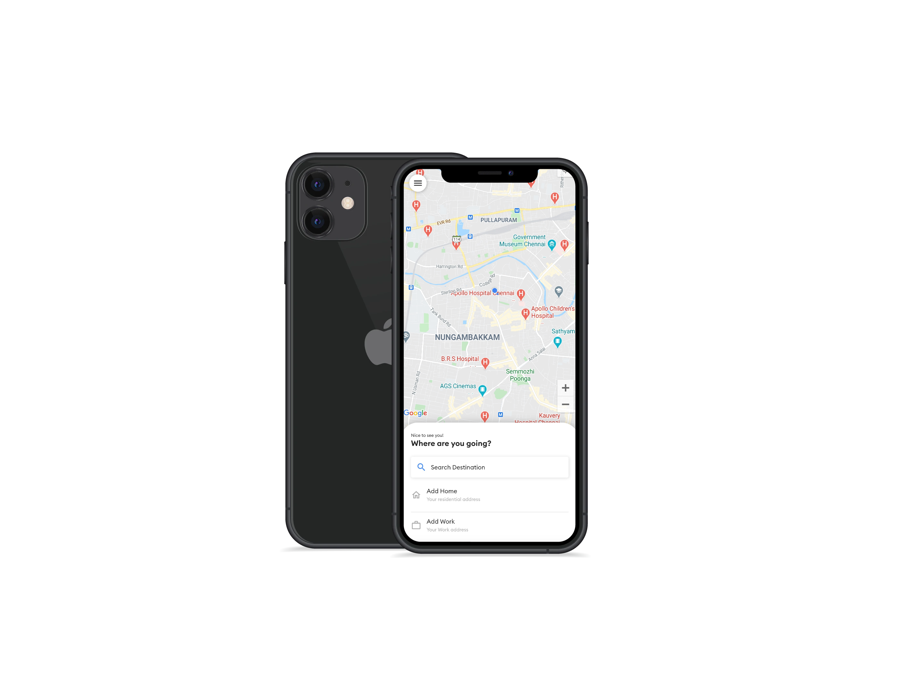
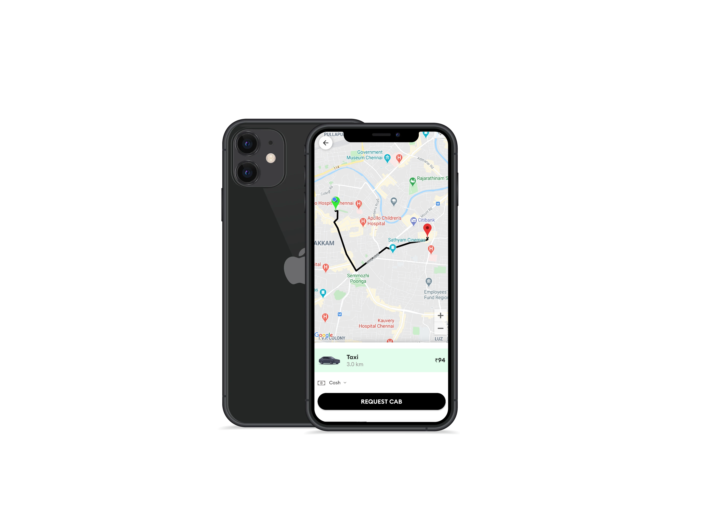
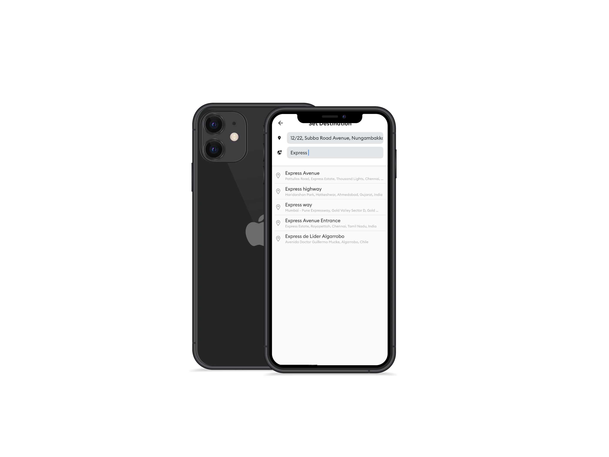

# CabApp
- App to request a cab ride to move through the city easily
- App to be a driver and do cab rides to earn wages
- Made in flutter ( Android + iOS )

## Backend
- Firebase Auth , Database
- Google cloud for maps and polling lines

## Rider App

  

## Driver App
Coming soon ...

### Key
If using the project make sure to replace mapKey='' with your own key available from gcp.

